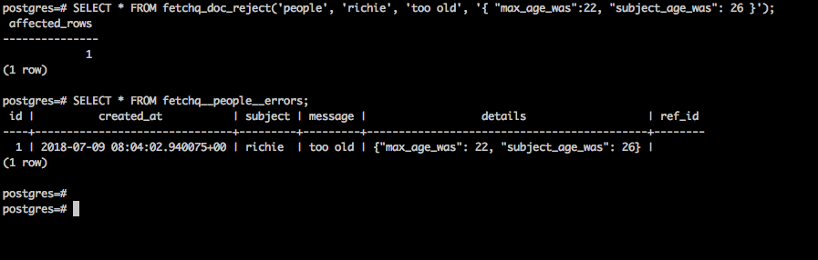

# Consume a queue

Horrayy, it's finally time do to some stuff with our documents!

**NOTE:** In this page we are going to simulate what is normally done by a worker. You don't
really write all this stuff by yourself, you use a _Fetchq_ client and focus on
the juice of document processing.

But for the moment we are just warming up with _Fetchq_ SQL functions, so here is
the roadmap for document processing:

- create a queue and insert some documents
- pick up a document for processing
- (take some wise decisions)
- resolve the document with an action

## Create a queue and insert some documents

```
# create the queue
SELECT * FROM fetchq_queue_create('people');

# add some documents
SELECT * FROM fetchq_doc_push('people', 'john', 0, 0, NOW(), '{ "age": 21 }');
SELECT * FROM fetchq_doc_push('people', 'jane', 0, 0, NOW(), '{ "age": 22 }');
SELECT * FROM fetchq_doc_push('people', 'agatha', 0, 0, NOW(), '{ "age": 23 }');
SELECT * FROM fetchq_doc_push('people', 'mike', 0, 0, NOW(), '{ "age": 24 }');
SELECT * FROM fetchq_doc_push('people', 'allie', 0, 0, NOW(), '{ "age": 25 }');
SELECT * FROM fetchq_doc_push('people', 'richie', 0, 0, NOW(), '{ "age": 26 }');
```

## Pick a document for processing

```
# Function signature
fetchq_doc_pick(
  queue::string          // queue name, es: "foo"
  version::int           // the version of the document, es: 0
  limit::int             // how many documents do you want to pick, es: 1
  timeout::interval      // maximum execution time for the worker
)

# SQL Example
SELECT * FROM fetchq_doc_pick('people', 0, 1, '5m');
```


This function returns documents (0-many) based on the limit you set and the presence of
pending documents in the queue.

## Data processing

The `subject` is the unique identifier of a document in the queue, that's all you need
later on to trigger actions on that specific document.

I often use the subject to refer to other tables ID, or a unique piece of info in my system
(es: the superhero name) so that I can refer with it to other tables in my database and
run some fairly complex operations.

In a web community project, say a LinkedIN clone, we use _Fetchq_ to gather info from
many relational tables into _Elasticsearch_ documents for fast indexing and read only access.
We can basically relay on an active cache that reacts to data changes.

## Resolve the document

When your fancy data processing is over you may want to take action and tell _Fetchq_
what to do with the document. There are 6 explicit actions that you can choose from:

* reschedule
* drop
* promote _(not yet impemented)_
* complete
* kill
* reject

**NOTE:** The seventh action is an **implicit reject** if the "timeout" is reached or if your
worker triggers an unexpected error (at least with the node client).

### Reschedule

```
# Function signature
fetchq_doc_reschedule(
  queue::string          // queue name, es: "foo"
  subject::string        // your unique id, es: "john"
  nextIteration::date    // when to execute the document again, es: "2081-06-30 15:05"
)

# SQL Example
SELECT * FROM fetchq_doc_reschedule('people', 'john', NOW() + INTERVAL '1 day');
```


### Drop

```
# Function signature
fetchq_doc_drop(
  queue::string          // queue name, es: "foo"
  subject::string        // your unique id, es: "john"
)

# SQL Example
SELECT * FROM fetchq_doc_drop('people', 'jane');
```


### Promote

**NOTE:** not yet implemented, might be available in `v1.3.x`

### Complete

```
# Function signature
fetchq_doc_complete(
  queue::string          // queue name, es: "foo"
  subject::string        // your unique id, es: "john"
  payload::jsonb         // optional - edit the payload
)

# SQL Example
SELECT * FROM fetchq_doc_complete('people', 'mike');
```


### Kill

```
# Function signature
fetchq_doc_kill(
  queue::string          // queue name, es: "foo"
  subject::string        // your unique id, es: "john"
  payload::jsonb         // optional - edit the payload
)

# SQL Example
SELECT * FROM fetchq_doc_kill('people', 'allie');
```


### Reject

```
# Function signature
fetchq_doc_reject(
  queue::string          // queue name, es: "foo"
  subject::string        // your unique id, es: "john"
  message::string        // error message
  payload::jsonb         // error details
  refId::string          // optional - reference id (es. processId)
)

# SQL Example
SELECT * FROM fetchq_doc_reject('people', 'richie', 'too old', '{ "max_age_was":22, "subject_age_was": 26 }');
```

